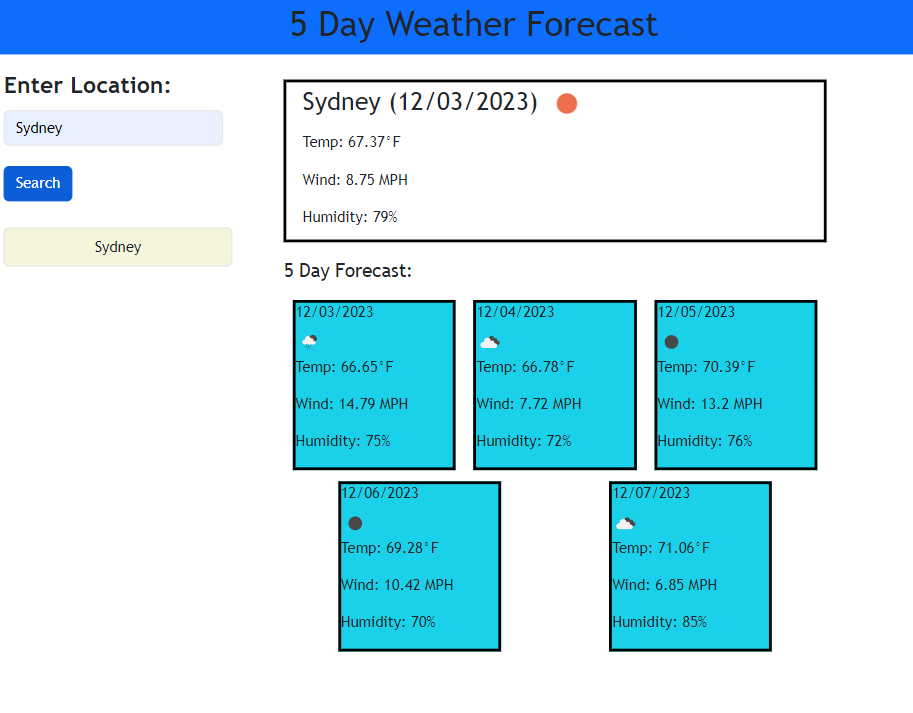

# weather-forecast

## Installation

N/A

## Usage

Deployed Page: 

GitHub Repo: https://github.com/smithz852/weather-forecast.git

The weather app is available to use upon entering the website. To start, enter your city of choice into the search input area and press the search button. The webpage will then display weather info for the current day and time, as well as a five day forecast. Your search history will be displayed below the search area. You can click on the listed cities to pull data for those cities again.

## License

MIT License
